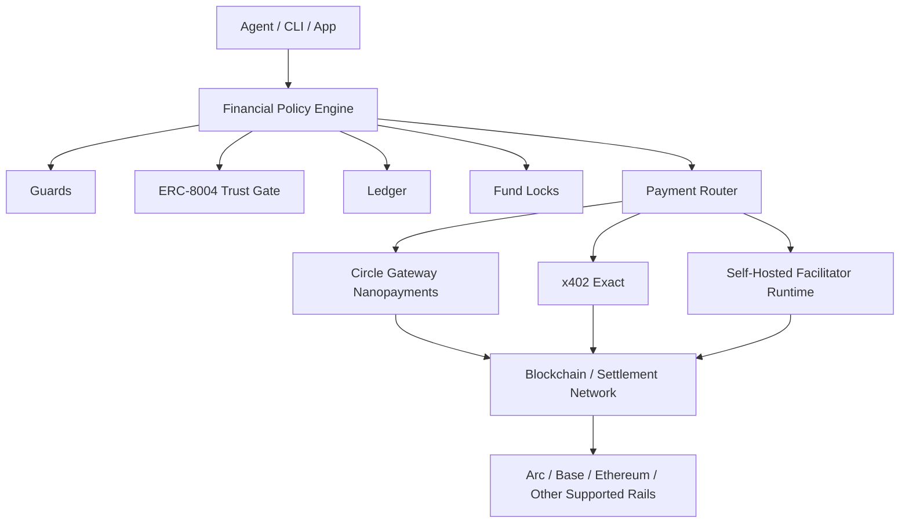

# OmniClaw

*One install. Every payment rail. Policy enforced by default.*

[](https://github.com/omnuron/omniclaw/actions/workflows/ci.yml)
[](https://pypi.org/project/omniclaw/)
[](https://pypi.org/project/omniclaw/)
[](LICENSE)

`lablab.ai Agentic Commerce Hackathon on ARC (1st place) · Top 11 finalist, C.R.I.S.P Agentic AI Ideation Challenge`

OmniClaw is the control layer for agent money.

It lets teams ship autonomous payments without giving software unrestricted wallet authority.

Wallets give keys. Facilitators settle payments. OmniClaw governs whether an agent is allowed to pay, routes the right rail, and gives vendors and infrastructure teams a usable product around that control model.

Buyers get policy. Vendors get paid endpoints. Infrastructure teams get self-hosted exact settlement on Arc, Base, and Ethereum.

## Proven In Public

- Arc Testnet exact settlement proof: `https://testnet.arcscan.app/tx/0xd40dc800a54bee4ff80da4709e65cfd3d0346eb1995ebc34fba433a6306b9219`
- 1st place at `lablab.ai Agentic Commerce Hackathon on ARC`
- Top 11 finalist in the `C.R.I.S.P Agentic AI Ideation Challenge`
- Shipped buyer CLI, buyer SDK, seller SDK, ERC-8004 trust checks, Circle Gateway nanopayments, and a self-hosted `x402 exact` facilitator runtime

If you want the fastest proof, run:

```bash
bash scripts/start_arc_marketplace_showcase_docker.sh
```

Then open `http://127.0.0.1:8020` and complete the browser buyer flow.

## Why Teams Use OmniClaw

| If you are... | OmniClaw gives you... |
| --- | --- |
| Building an agent buyer | Policy-controlled payments without giving the agent raw wallet authority |
| Monetizing an API or service | Paid routes through `client.sell(...)` and x402-compatible seller flows |
| Running payment infrastructure | Route selection across Circle Gateway and standard `x402 exact`, plus self-hosted exact settlement when hosted coverage stops short |

## Pick A Path In 60 Seconds

One product, three adoption paths: autonomous buyers, paid vendors, and self-hosted settlement infrastructure.

| I want to... | Run this first | Success looks like... | Jump to... |
| --- | --- | --- | --- |
| Try the full Arc flow now | `bash scripts/start_arc_marketplace_showcase_docker.sh` | browser kiosk + buyer flow + self-hosted exact settlement | [Arc Marketplace Showcase](examples/arc-marketplace-showcase/README.md) |
| Let an agent buy from paid APIs | `omniclaw server` + `omniclaw-cli pay` | agent pays through policy, not a raw key | [Buyer: Agent CLI](#buyer-agent-cli) |
| Pay programmatically from Python | `OmniClaw().pay(...)` | Python service buys from paid APIs | [Buyer: Python SDK](#buyer-python-sdk) |
| Monetize a vendor API | `OmniClaw().sell(...)` | FastAPI route returns `402` until paid | [Seller: Vendor / Enterprise SDK](#seller-vendor--enterprise-sdk) |
| Run your own exact facilitator | `omniclaw facilitator exact` | self-hosted `verify` / `settle` on supported EVM networks | [Self-Hosted Exact Facilitator](#self-hosted-exact-facilitator) |

## The Problem

AI agents can browse, reason, call APIs, and execute workflows autonomously.

The dangerous part is money.

Give an agent a private key and a single hallucination, prompt injection, or bad tool call can drain a treasury in seconds. Existing solutions usually hand the agent a wallet and hope for the best.

OmniClaw solves this by separating authority from execution. The owner defines policy. The agent executes within it. Every payment is checked before funds move.

In one sentence: OmniClaw is the economic execution and control layer for agentic systems.

## Prerequisites

| Path | What you need |
| --- | --- |
| Arc showcase | Docker |
| Buyer CLI | Python 3.11+, funded EVM key, RPC URL |
| Buyer SDK | Python 3.11+, RPC URL |
| Seller SDK | Python 3.11+, optional Circle credentials for Gateway flows |
| Self-hosted facilitator | Python 3.11+, funded EVM key, RPC URL |

## Install And Run

```bash
pip install omniclaw
```

Package development:

```bash
uv add omniclaw
```

## Wallets vs Facilitators vs OmniClaw

| Layer | What it does | What it does not do |
| --- | --- | --- |
| Wallets | Hold keys and sign | Decide whether an agent should be allowed to spend |
| Facilitators | Verify and settle supported payment payloads | Govern financial authority before money moves |
| OmniClaw | Enforces policy before payment, routes the right rail, supports buyer and seller flows, and can self-host exact settlement when needed | Replace every settlement provider or blockchain rail |

OmniClaw is a policy-controlled payment layer for agents and vendors. It lets agents pay through approved rails, lets vendors monetize routes, and lets infrastructure teams run or self-host settlement when hosted facilitators stop short.

Core shipped surfaces:

- Financial Policy Engine for payment authority, limits, approvals, trust checks, and execution control
- `omniclaw-cli` for agent-side buyer execution
- Python SDK for buyer payments and seller monetization
- Circle Gateway nanopayments for gasless microflows
- Standard `x402 exact` buyer flow with direct-wallet signing
- Self-hosted `x402 exact` facilitator for Arc Testnet, Base Sepolia, Ethereum Sepolia, Base mainnet, and Ethereum mainnet

> OmniClaw governs financial authority. Facilitators settle supported x402 payment payloads. These are separate concerns.

## Credential Model

OmniClaw has two different key surfaces:

- `OMNICLAW_PRIVATE_KEY` is the EOA key used for direct `x402 exact` settlement and Circle Gateway nanopayment signing.
- `ENTITY_SECRET` is Circle's developer-controlled wallet encryption secret.

If your Circle account or API key already has an Entity Secret, set it directly. Circle allows one active Entity Secret per account and API key. OmniClaw only auto-generates and registers a new one when no existing secret is provided or found in its managed local credential store.

```bash
export CIRCLE_API_KEY="..."
export ENTITY_SECRET="your_existing_64_char_hex_entity_secret"
export OMNICLAW_PRIVATE_KEY="0x..."
```

For a non-interactive local setup:

```bash
omniclaw setup --api-key "$CIRCLE_API_KEY" --entity-secret "$ENTITY_SECRET"
```

## Default Product Shapes

- Agent buyer: run the Financial Policy Engine, then pay with `omniclaw-cli`
- Application buyer: integrate `client.pay(...)` in Python
- Vendor seller: monetize routes with `client.sell(...)`
- Infrastructure operator: run `omniclaw facilitator exact` for self-hosted exact settlement

## Buyer: Agent CLI

Use this when an autonomous agent or script should pay through the Financial Policy Engine.

Start the policy engine:

```bash
export OMNICLAW_PRIVATE_KEY="0x..."
export OMNICLAW_AGENT_TOKEN="agent-token"
export OMNICLAW_AGENT_POLICY_PATH="./policy.json"
export OMNICLAW_NETWORK="BASE-SEPOLIA"
export OMNICLAW_RPC_URL="https://sepolia.base.org"

omniclaw server --port 8080
```

Configure the agent runtime:

```bash
export OMNICLAW_SERVER_URL="http://localhost:8080"
export OMNICLAW_TOKEN="agent-token"
```

Pay a protected x402 URL:

```bash
omniclaw-cli can-pay --recipient https://seller.example.com/compute
omniclaw-cli inspect-x402 --recipient https://seller.example.com/compute
omniclaw-cli pay --recipient https://seller.example.com/compute --idempotency-key job-123
```

Pay a direct address:

```bash
omniclaw-cli pay \
  --recipient 0xRecipientAddress \
  --amount 5.00 \
  --purpose "service payment" \
  --idempotency-key job-123
```

The same CLI surface can also inspect balances, ledger entries, and paid endpoint requirements without exposing private keys to the agent.

## Buyer: Python SDK

Use this when a Python service should pay programmatically.

```python
from omniclaw import Network, OmniClaw

client = OmniClaw(network=Network.BASE_SEPOLIA)

result = await client.pay(
    wallet_id="wallet-id",
    recipient="https://seller.example.com/compute",
    amount="1.00",
    purpose="compute job",
    idempotency_key="job-123",
    check_trust=True,
)

print(result.status, result.blockchain_tx or result.transaction_id)
```

For x402 URLs, `amount` acts as the maximum spend allowed for that request. The seller's x402 requirements define the exact amount to settle.

When trust is enabled, OmniClaw can evaluate ERC-8004 identity and reputation signals before the payment is allowed to proceed.

## Seller: Vendor / Enterprise SDK

Use this when a vendor, enterprise, or application team wants to monetize API routes. This is the default seller path for real products.

```python
from fastapi import FastAPI
from omniclaw import OmniClaw

app = FastAPI()
client = OmniClaw()

@app.get("/premium-data")
async def premium_data(
    payment=client.sell("$0.25", seller_address="0xYourSellerWallet")
):
    return {
        "data": "premium content",
        "paid_by": payment.payer,
        "amount": payment.amount,
    }
```

The route returns `402 Payment Required` until the buyer submits a valid x402 payment. After verification and settlement, the handler executes and returns the paid response.

`omniclaw-cli serve` remains the agent-facing seller/runtime surface. Use it when an agent needs to expose a paid endpoint for other agents or automation. Use the SDK seller path when a vendor or enterprise team is embedding paid routes directly into an application.

## Self-Hosted Exact Facilitator

Hosted facilitators do not support every chain, every flow, or every developer workflow. Some require managed accounts, signup gates, or hosted onboarding before you can even run a demo.

OmniClaw ships a self-hosted `x402 exact` facilitator so you can run standard `verify` and `settle` yourself.

What it does:

- runs a standard `x402 exact` facilitator runtime
- verifies signed payment payloads
- settles payments on supported EVM profiles
- removes dependency on hosted onboarding for unsupported flows

Supported out of the box:

- Arc Testnet
- Base Sepolia
- Ethereum Sepolia
- Base mainnet
- Ethereum mainnet

Start it with one command:

```bash
omniclaw facilitator exact --network-profile ARC-TESTNET --port 4022
```

Or use the helper script:

```bash
bash scripts/start_arc_exact_facilitator.sh
```

Arc Testnet notes:

- Arc Testnet uses native USDC for gas
- the exact settlement path calls Arc USDC `transferWithAuthorization`
- the result is visible on ArcScan like any other on-chain proof

Latest public Arc proof transaction:

```text
https://testnet.arcscan.app/tx/0xd40dc800a54bee4ff80da4709e65cfd3d0346eb1995ebc34fba433a6306b9219
```

Full Arc marketplace showcase:

```bash
bash scripts/start_arc_marketplace_showcase_docker.sh
```

That launcher starts the vendor kiosk, buyer policy engine, and self-hosted facilitator together so the entire buyer-to-seller flow can be demonstrated from one browser page.

## Examples

| Example | Demonstrates |
| --- | --- |
| [B2B SDK Integration](examples/b2b-sdk-integration/README.md) | Enterprise buyer and seller SDK integration with multiple facilitators |
| [Machine to Machine](examples/machine-to-machine/README.md) | One machine service paying another |
| [Machine to Vendor](examples/machine-to-vendor/README.md) | Agent buyer paying a vendor-owned API |
| [Vendor Integration](examples/vendor-integration/README.md) | Vendor-side paid API integration |
| [Business Compute](examples/business-compute/README.md) | Payment-gated compute service |
| [Local Economy](examples/local-economy/README.md) | Local buyer and seller economy with Docker |
| [External x402 Facilitator](examples/external-x402-facilitator/README.md) | x402.org Base Sepolia validation |
| [Thirdweb HTTP Facilitator](examples/thirdweb-http-facilitator/README.md) | Thirdweb HTTP API validation |
| [Arc Marketplace Showcase](examples/arc-marketplace-showcase/README.md) | Visual vendor kiosk with Arc Testnet x402 exact settlement |

## Architecture



## Execution Pipeline

Every `client.pay()` call runs through:

1. Argument validation
2. Trust evaluation when enabled
3. Ledger entry creation
4. Guard reservation
5. Wallet fund lock acquisition
6. Balance verification after reservations
7. Router and adapter selection
8. Guard commit or release
9. Ledger status update
10. Wallet lock release

This is why OmniClaw is not just a thin wallet wrapper. The payment call is a controlled execution pipeline, not a raw transfer helper.

## Documentation

| Start Here | Use Case |
| --- | --- |
| [Documentation Index](docs/README.md) | Complete docs map |
| [Architecture and Features](docs/FEATURES.md) | Financial Policy Engine design and subsystem responsibilities |
| [Developer Guide](docs/developer-guide.md) | Python SDK buyer and seller integration |
| [Agent Getting Started](docs/agent-getting-started.md) | Agent CLI setup and usage |
| [CLI Reference](docs/cli-reference.md) | Generated `omniclaw-cli` reference |
| [Operator CLI](docs/operator-cli.md) | `omniclaw server`, setup, policy, and facilitator commands |
| [Policy Reference](docs/POLICY_REFERENCE.md) | Policy file structure and controls |
| [Facilitators](docs/facilitators.md) | x402 facilitator model and deployment paths |
| [Production Readiness](docs/production-readiness.md) | Proof status and release checklist |
| [API Reference](docs/API_REFERENCE.md) | Python SDK and API details |
| [ERC-8004 Trust Notes](docs/erc_804_spec.md) | Trust-layer notes and registry framing |

[Star history](https://star-history.com/#omnuron/omniclaw&Date)

## Development

```bash
uv sync --extra dev
uv run pytest
```

Release verification:

```bash
./scripts/release_verify.sh
```

## Security

OmniClaw is designed around separation of authority. Agents do not need unrestricted wallet access. Production deployments should still use restricted keys, policy limits, confirmation thresholds, hardened secrets, audited infrastructure, and real operational review.

Report vulnerabilities through [SECURITY.md](SECURITY.md).

## License

MIT. See [LICENSE](LICENSE).
