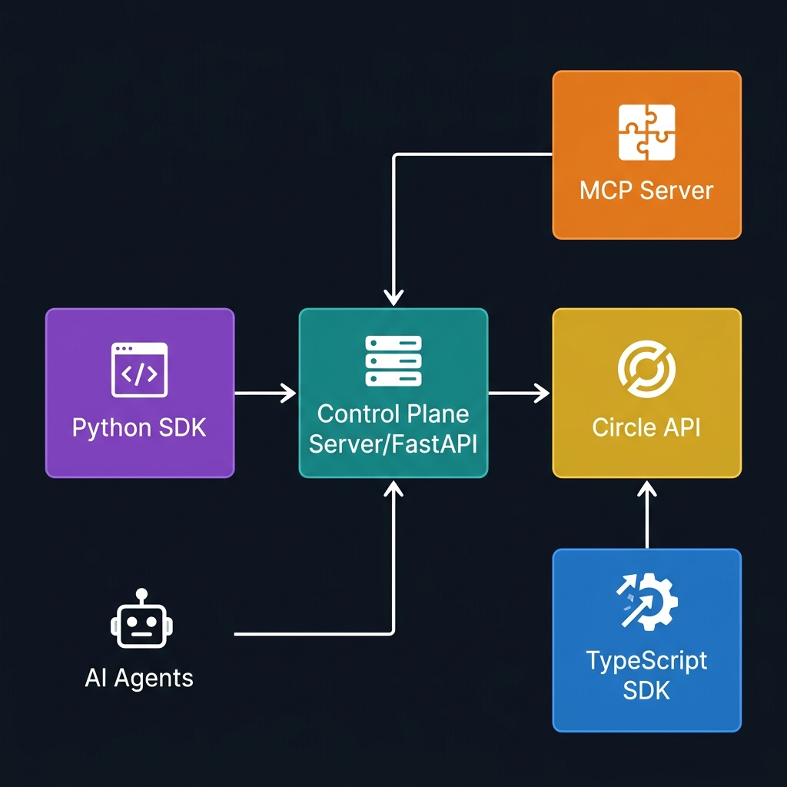
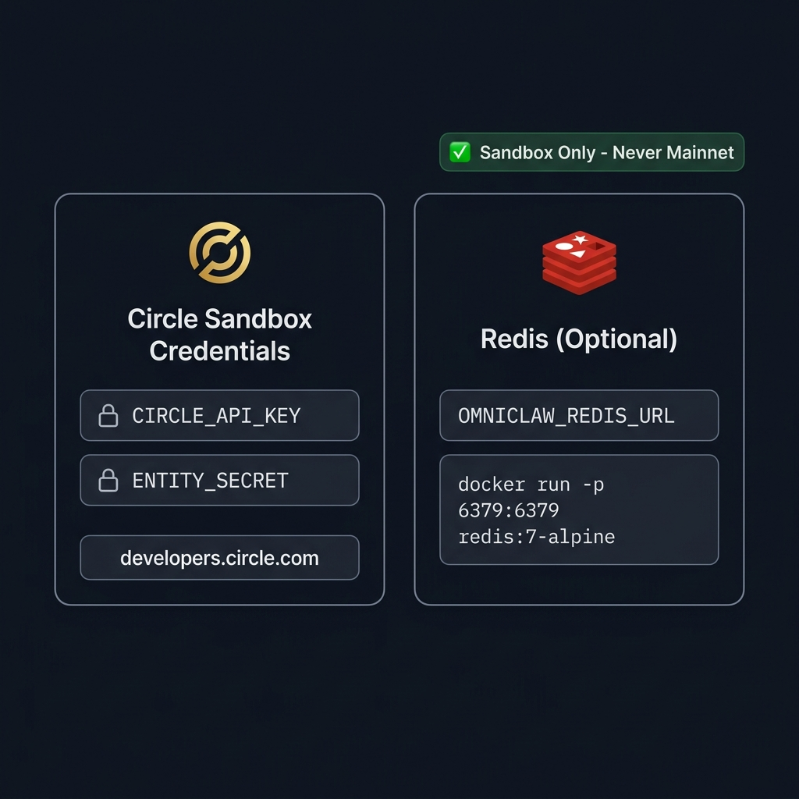
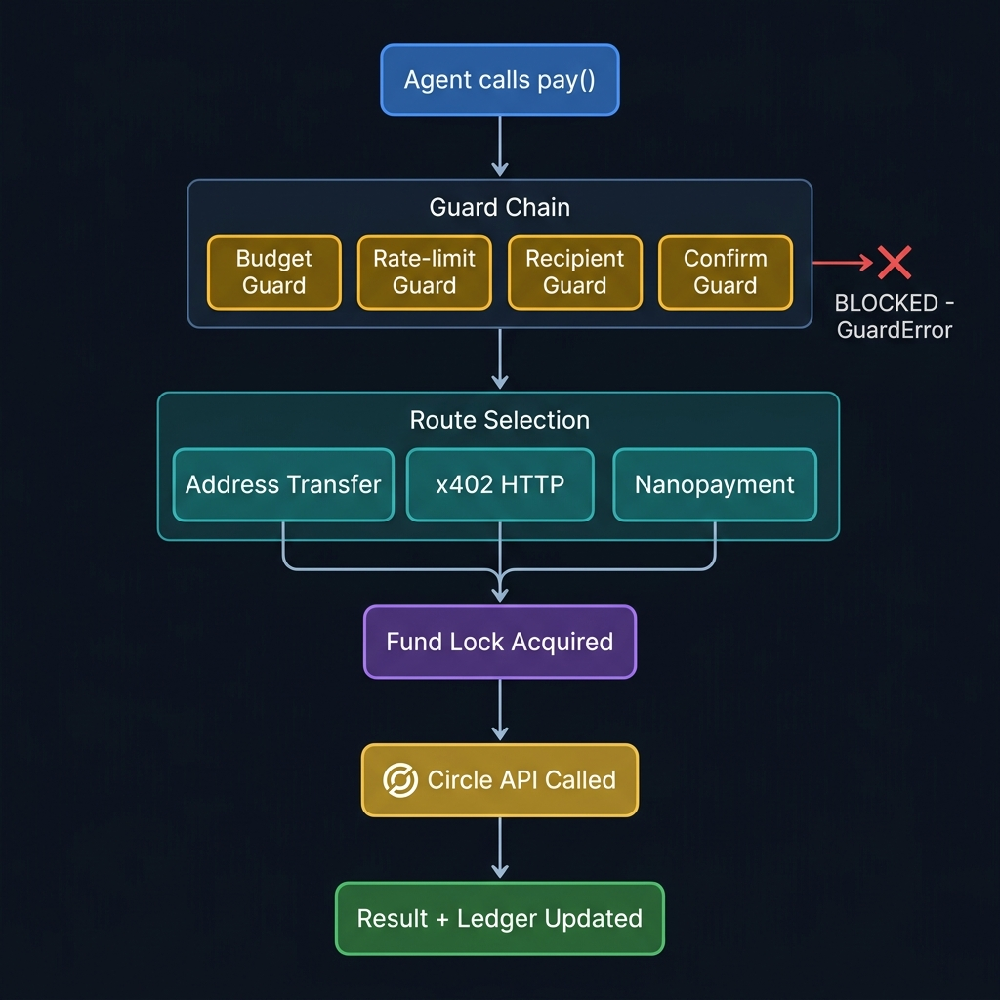
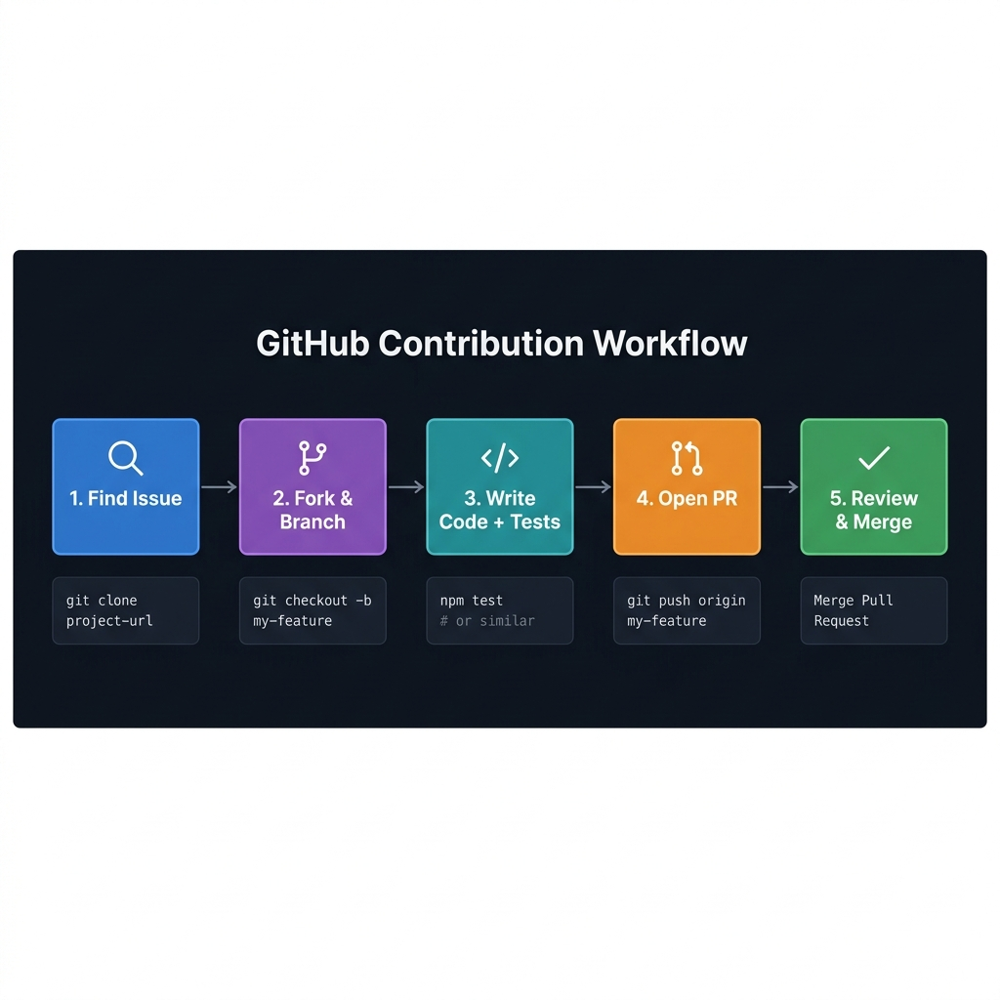

# OmniClaw — Contributor Guide

<div align="center">

**The payment infrastructure layer for autonomous AI agents.**

[](https://python.org)
[](../LICENSE)
[](https://github.com/omnuron/omniclaw/pulls)
[](https://github.com/omnuron/omniclaw/issues?q=label%3A%22help+wanted%22)

</div>

> **New here? Start here.**
> This guide explains every area of the repository, how to set up your
> environment, what credentials you need, how to pick an issue, and how to
> open a PR that gets merged.

---

## Table of Contents

| | Section |
|---|---|
| 🗺️ | [Repository Map](#️-repository-map) |
| 🏗️ | [Architecture Overview](#️-architecture-overview) |
| ⚡ | [Quick Setup](#-quick-setup-tl-dr) |
| 🔧 | [Detailed Local Setup](#-detailed-local-setup) |
| 🔑 | [Credentials — Circle Sandbox & Redis](#-credentials--circle-sandbox--redis) |
| 💳 | [Payment Execution Flow](#-payment-execution-flow) |
| ✅ | [Running Tests](#-running-tests) |
| 🎯 | [Picking an Issue](#-picking-an-issue) |
| 🚀 | [Opening a Pull Request](#-opening-a-pull-request) |
| 📐 | [Coding Standards](#-coding-standards) |
| 🚫 | [What to Avoid](#-what-to-avoid) |

---

## 🗺️ Repository Map

```
omniclaw/
│
├── src/omniclaw/                    # ◀ Python SDK — the core product
│   │
│   ├── client.py                    #   Main OmniClaw() entry point
│   │                                #   pay(), simulate(), sell()
│   ├── cli.py                       #   `omniclaw` CLI (server/setup/doctor/env)
│   ├── cli_agent.py                 #   `omniclaw-cli` — agent-facing wallet CLI
│   ├── onboarding.py                #   First-run credential setup helpers
│   │
│   ├── core/                        #   Foundation layer
│   │   ├── config.py                #     Config dataclass (env-driven, frozen)
│   │   ├── types.py                 #     Shared types: Network, PaymentResult…
│   │   ├── exceptions.py            #     All SDK exceptions
│   │   ├── logging.py               #     get_logger("omniclaw.X") pattern
│   │   └── state_machine.py         #     Payment intent FSM
│   │
│   ├── guards/                      #   ◀ Policy enforcement chain
│   │   ├── budget.py                #     Daily / hourly spend limits
│   │   ├── rate_limit.py            #     Transaction velocity controls
│   │   ├── recipient.py             #     Whitelist enforcement
│   │   └── confirm.py               #     Human-in-the-loop threshold
│   │
│   ├── protocols/                   #   Payment protocol implementations
│   │   ├── x402.py                  #     HTTP 402 payment flow
│   │   ├── gateway.py               #     Circle Gateway (nanopayments)
│   │   ├── transfer.py              #     Direct USDC transfer
│   │   └── nanopayments/            #     EIP-3009 signing, vault, adapter
│   │
│   ├── trust/                       #   ERC-8004 Trust Gate
│   ├── wallet/                      #   Circle-backed wallet management
│   ├── payment/                     #   Payment routing and execution
│   ├── intents/                     #   Payment intent lifecycle
│   ├── ledger/                      #   Transaction ledger persistence
│   ├── seller/                      #   Seller SDK + facilitated transfers
│   ├── agent/                       #   FastAPI control-plane server
│   │   ├── server.py                #     App factory
│   │   ├── routes.py                #     HTTP endpoints
│   │   ├── auth.py                  #     Token authentication
│   │   └── policy.py                #     Policy enforcement
│   │
│   ├── resilience/                  #   Circuit breaker
│   ├── storage/                     #   Memory + Redis storage backends
│   ├── webhooks/                    #   Webhook signature verification
│   └── skills/                      #   v1 Installable skills framework
│       ├── manifest.py              #     SkillManifest Pydantic model
│       ├── registry.py              #     In-memory SkillRegistry
│       └── loader.py                #     load_skills_from_directory()
│
├── mcp_server/                      # ◀ Standalone MCP server
│   └── app/                         #   Separate pyproject.toml + lockfile
│
├── npm/omniclaw/                    # ◀ TypeScript SDK (PR open)
│   │                                #   Full parity with Python SDK
│   ├── src/OmniClaw.ts              #   Main client
│   ├── src/ops/                     #   Guards, budget, rate limiting
│   └── src/seller/                  #   Seller helpers
│
├── tests/                           # ◀ Python SDK test suite
│   ├── conftest.py                  #   Circle API auto-mock, env isolation
│   ├── nanopayments/                #   Nanopayment-specific sub-suite
│   ├── test_skills.py               #   Skills framework tests (offline)
│   └── test_*.py                    #   One file per module
│
├── examples/agent/                  # ◀ Usage examples
│   ├── omnicore_agent_demo.py       #   Full agent payment demo
│   └── policy.json                  #   Example policy configuration
│
├── .agents/skills/                  # ◀ Agent instruction skills
│   ├── omniclaw-cli/SKILL.md        #   Teaches AI agents to use the CLI
│   └── hello-world/                 #   Example installable skill
│       ├── skill.json               #   Machine-readable manifest
│       └── prompt.md                #   Agent instruction template
│
├── docs/                            # ◀ Documentation
│   ├── CONTRIBUTOR_GUIDE.md         #   This file
│   ├── installable-skills.md        #   Skills framework reference
│   ├── SDK_USAGE_GUIDE.md           #   Python SDK guide
│   ├── API_REFERENCE.md             #   API reference
│   └── img/                         #   Diagrams used in docs
│
├── pyproject.toml                   # Python package (hatchling + uv)
├── pytest.ini                       # Test settings
├── CONTRIBUTING.md                  # Short contribution summary
├── ROADMAP.md                       # What is built / planned
└── SECURITY.md                      # Responsible disclosure
```

---

## 🏗️ Architecture Overview



OmniClaw has **four independent surfaces** that share the same Circle API backend:

| Surface | Location | Language | Who uses it |
|---|---|---|---|
| **Python SDK** | `src/omniclaw/` | Python 3.10+ | Python devs and autonomous agents |
| **Control Plane** | `src/omniclaw/agent/` | FastAPI | Operators self-hosting the server |
| **MCP Server** | `mcp_server/` | FastAPI | AI models using the MCP protocol |
| **TypeScript SDK** | `npm/omniclaw/` | TypeScript/Node | JS/TS developers and agents |

> **Important:** Each surface is independently deployable. The MCP server has its own
> `pyproject.toml`. The TypeScript SDK has its own `package.json`. Changes to one do not
> require changes to the others.

---

## ⚡ Quick Setup (TL;DR)

```bash
# 1. Clone and install
git clone https://github.com/omnuron/omniclaw.git
cd omniclaw
uv sync --extra dev

# 2. Create your .env
echo "CIRCLE_API_KEY=your_sandbox_key" >> .env
echo "ENTITY_SECRET=your_64_char_secret" >> .env
echo "OMNICLAW_STORAGE_BACKEND=memory" >> .env

# 3. Verify everything is wired up
.venv/bin/python -m omniclaw doctor

# 4. Run the tests (no credentials needed)
.venv/bin/pytest tests/ -v --tb=short
```

That's it. If `doctor` shows green, you are ready to contribute.

---

## 🔧 Detailed Local Setup

### Prerequisites

| Tool | Version | Purpose |
|---|---|---|
| Python | 3.10+ | SDK and server |
| [uv](https://github.com/astral-sh/uv) | Latest | Fast package manager (recommended) |
| Git | Any | Version control |
| Docker | Optional | Redis, MCP server |
| Node.js | 18+ | TypeScript SDK only |

### Python SDK setup

```bash
# Clone
git clone https://github.com/omnuron/omniclaw.git
cd omniclaw

# Install all dev dependencies (creates .venv automatically)
uv sync --extra dev
```

**Without uv** (plain pip):

```bash
python -m venv .venv

# Linux / macOS
source .venv/bin/activate

# Windows
.venv\Scripts\activate

pip install -e ".[dev]"
```

**Verify the install:**

```bash
.venv/bin/python -c "import omniclaw; print(omniclaw.__version__)"
# → 0.0.2
```

### MCP Server setup

The MCP server is a separate sub-project with its own lockfile. Keep it isolated:

```bash
cd mcp_server
uv sync
# Start the server
uvicorn app.main:app --reload --port 8000
```

### TypeScript SDK setup

```bash
cd npm/omniclaw
npm install

# Type-check and lint
npm run release:check

# Run the offline smoke test (no Circle calls)
npm run smoke:validate
```

### Start the Control Plane server

```bash
# From repo root — loads .env automatically
omniclaw server --port 8088 --reload

# Or with Docker Compose
docker-compose up -d
# Server at http://localhost:8088
```

---

## 🔑 Credentials — Circle Sandbox & Redis



### Circle sandbox credentials

Most tests run fully offline — the Circle client is auto-mocked in `tests/conftest.py`.
You only need real credentials for `@pytest.mark.requires_api` tests.

#### Getting credentials

1. Go to [developers.circle.com](https://developers.circle.com) and create a free account
2. Create an **API Key** in the **Sandbox** environment (not mainnet)
3. Run the OmniClaw setup wizard to generate your Entity Secret:

```bash
omniclaw setup --api-key YOUR_SANDBOX_KEY
# Outputs a .env.agent file with both credentials
```

Or run the interactive setup:

```bash
omniclaw setup
# → Enter your Circle API Key: ...
# → Generating and registering new Entity Secret...
# → ✨ Successfully configured .env.agent!
```

#### What each credential does

| Variable | What it is | Where it's used |
|---|---|---|
| `CIRCLE_API_KEY` | Circle API authentication | Every Circle API call (wallets, transfers, balances) |
| `ENTITY_SECRET` | 64-char hex secret for tx signing | EIP-3009 authorization, ERC-20 approvals |

> ⚠️ **Never commit these.** Both are in `.gitignore`. If you accidentally
> expose them, rotate them in the Circle dashboard immediately.

> ✅ **Always use Sandbox** for development. Sandbox uses test USDC on
> `ARC-TESTNET`. Set `OMNICLAW_ENV=development` (the default) to stay in sandbox mode.

#### Diagnosing your setup

```bash
omniclaw doctor
```

Expected output when everything is configured:

```
✅  CIRCLE_API_KEY     found (sk_san...cdef)
✅  ENTITY_SECRET      found (64 chars)
✅  Wallet             connected — 0x742d35Cc...
✅  Circle             reachable
✅  Storage            memory
```

### Redis

Redis is **optional** for most local work. You only need it when working on:

- Distributed fund-locking (`OMNICLAW_STORAGE_BACKEND=redis`)
- Multi-instance nonce tracking (`OMNICLAW_SELLER_NONCE_REDIS_URL`)
- Redis Streams event bus (planned)

**Spin up Redis locally (Docker):**

```bash
docker run -d -p 6379:6379 --name omniclaw-redis redis:7-alpine
```

**Then set:**

```bash
OMNICLAW_STORAGE_BACKEND=redis
OMNICLAW_REDIS_URL=redis://localhost:6379/0
```

**Without Redis:** leave `OMNICLAW_STORAGE_BACKEND` unset (defaults to `memory`).
All CI tests use the memory backend — this is enforced by `tests/conftest.py`.

---

## 💳 Payment Execution Flow

Understanding the payment flow helps you know which area of the code you're working in.



### Step-by-step

```
┌─────────────────────────────────────────────────────────────┐
│                                                             │
│   1.  agent calls client.pay(recipient, amount, wallet_id)  │
│                          │                                  │
│   2.  Guard Chain        ▼                                  │
│       ┌──────────────────────────────────────────┐          │
│       │  BudgetGuard → RateLimitGuard →           │          │
│       │  RecipientGuard → ConfirmGuard            │          │
│       └──────────────────────────────────────────┘          │
│             │ PASS                   │ FAIL                 │
│             ▼                        ▼                      │
│   3.  Route selected            GuardError raised           │
│       ┌──────────────────────┐                              │
│       │ address transfer     │                              │
│       │ x402 HTTP payment    │                              │
│       │ Circle nanopayment   │                              │
│       └──────────────────────┘                              │
│             │                                               │
│   4.  Fund lock acquired (prevents double-spend)            │
│             │                                               │
│   5.  Circle API called                                     │
│             │                                               │
│   6.  PaymentResult returned + Ledger updated               │
│                                                             │
└─────────────────────────────────────────────────────────────┘
```

> **Rule:** If your change could affect whether a payment succeeds, fails, is
> double-charged, or skips a guard — it needs dedicated tests and careful review.
> See [What to Avoid](#-what-to-avoid).

### Key files in the payment path

| File | What it does |
|---|---|
| `src/omniclaw/client.py` | `pay()` orchestration |
| `src/omniclaw/guards/manager.py` | Guard chain runner |
| `src/omniclaw/protocols/gateway.py` | Circle Gateway / nanopayment protocol |
| `src/omniclaw/protocols/x402.py` | HTTP 402 payment protocol |
| `src/omniclaw/protocols/transfer.py` | Direct USDC transfer |
| `src/omniclaw/wallet/` | Fund locking and balance management |

---

## ✅ Running Tests

### All tests (no credentials needed)

```bash
.venv/bin/pytest tests/ -v --tb=short
```

The `tests/conftest.py` automatically mocks the Circle client for every test.
No API key needed for the standard suite.

### Filter by area

```bash
# Skills framework only (fastest, 30 tests, fully offline)
.venv/bin/pytest tests/test_skills.py -v

# Config tests
.venv/bin/pytest tests/test_config.py -v

# Nanopayment tests
.venv/bin/pytest tests/nanopayments/ -v

# Guard tests
.venv/bin/pytest tests/test_guards.py -v
```

### Only tests that need Circle sandbox

```bash
.venv/bin/pytest tests/ -m requires_api -v
```

### Static checks

```bash
# Lint and import order (must pass before PR)
.venv/bin/ruff check src tests

# Type checking
.venv/bin/mypy src

# Compile check
python -m compileall src
```

### Release check (runs all of the above)

```bash
./build.sh
```

### TypeScript SDK

```bash
cd npm/omniclaw
npm run release:check       # type-check + lint
npm run smoke:validate      # offline integration smoke test
```

### Expected output when all tests pass

```
========================= test session starts ==========================
platform ...
collected 56 items

tests/test_config.py ..................                          [ 32%]
tests/test_exceptions.py .........                              [ 48%]
tests/test_guards.py ...............                            [ 75%]
tests/test_skills.py ..............................              [100%]

========================= 56 passed in 3.42s ===========================
```

---

## 🎯 Picking an Issue



### Where to look

Browse [open issues](https://github.com/omnuron/omniclaw/issues) and filter by label:

| Label | What it means |
|---|---|
| `good first issue` | Self-contained, well-scoped — great for first PRs |
| `help wanted` | Maintainers need help here |
| `documentation` | Docs-only changes, no complex code needed |
| `high priority` | Blocking others — most impactful |

### Good starting areas by experience level

**New to the repo:**
- `docs/` improvements — incorrect commands, missing examples, typos
- New example skills in `.agents/skills/` (copy `hello-world/` as a template)
- Additional examples in `examples/agent/`

**Comfortable with Python:**
- Improving test coverage (check `test_*.py` for `# TODO` comments)
- CLI improvements in `src/omniclaw/cli.py`
- MCP server tool handler improvements

**Experienced with payments / blockchain:**
- TypeScript SDK (`npm/omniclaw/`) — review or extend PR #19
- Guard edge cases in `src/omniclaw/guards/`
- Trust Gate improvements in `src/omniclaw/trust/`

### Before you start

1. **Comment on the issue** saying you're working on it — avoids duplicate work
2. **Read the relevant code** before editing — understand the existing behavior
3. **Check existing tests** — understand what is already covered

### Example: picking and claiming a good first issue

```
1. Go to Issues → filter by "good first issue"
2. Read the issue body + acceptance criteria
3. Post a comment:
   "Hi, I'd like to work on this. My approach would be to [brief plan]."
4. Wait for maintainer confirmation (usually quick)
5. Create your branch and start coding
```

---

## 🚀 Opening a Pull Request

### The full workflow

```bash
# 1. Fork the repo on GitHub, then clone your fork
git clone https://github.com/YOUR_USERNAME/omniclaw.git
cd omniclaw

# 2. Add the upstream remote
git remote add upstream https://github.com/omnuron/omniclaw.git

# 3. Create a branch (name it after the issue/feature)
git checkout -b feat/my-feature-name
# or
git checkout -b fix/issue-123-guard-reset

# 4. Make your changes
# ... write code + tests ...

# 5. Run checks
.venv/bin/pytest tests/ -v --tb=short
.venv/bin/ruff check src tests

# 6. Commit with a clear message
git commit -m "feat(guards): add per-recipient rate limiting

Closes #42. Adds a new RecipientRateLimitGuard that applies a
per-address velocity cap independent of the global rate limit.

Tests: tests/test_guard_recipient_rate.py (12 new tests)
"

# 7. Push and open the PR
git push origin feat/my-feature-name
# → Open the PR on GitHub
```

### Branch naming

| Type | Pattern | Example |
|---|---|---|
| Feature | `feat/description` | `feat/installable-skills` |
| Bug fix | `fix/description` | `fix/budget-guard-daily-reset` |
| Documentation | `docs/description` | `docs/contributor-guide` |
| Tests | `test/description` | `test/nanopayment-vault-coverage` |
| CI/Build | `ci/description` | `ci/add-mypy-to-workflow` |

### Commit message format

Follow [Conventional Commits](https://conventionalcommits.org):

```
type(scope): short description (max 72 chars)

Optional longer body explaining WHY, not what.
Reference issues with "Closes #N" or "Refs #N".
```

**Types:** `feat` `fix` `docs` `test` `refactor` `ci` `chore`

**Scopes:** `sdk` `guards` `nanopayments` `trust` `mcp` `skills` `cli` `npm` `docs`

**Examples:**

```bash
feat(skills): add v1 installable skills framework
fix(guards): correct daily budget reset at UTC midnight
docs(contrib): add contributor guide with architecture diagrams
test(nanopayments): cover vault key rotation edge cases
feat(npm): add TypeScript parity for nanopayment client
```

### PR description template

```markdown
## What this PR does

[1-2 sentences. What problem does it solve?]

Closes #[issue number]

## Changes

**New files:**
- `src/omniclaw/X.py` — [what it does]

**Modified files:**
- `src/omniclaw/Y.py` — [what changed and why]

## How to test

```bash
pytest tests/test_X.py -v
```

Credentials needed: No / Yes (Circle sandbox only)

## Notes

[Anything reviewers should know — tradeoffs, alternatives considered, future work]
```

### What reviewers look for

- ✅ Does it solve the stated problem with minimal scope?
- ✅ Existing tests still pass
- ✅ New behavior has new tests
- ✅ Diff is small enough to review in one session
- ✅ No unrelated changes bundled in
- ✅ `ruff` and `mypy` pass

---

## 📐 Coding Standards

### Python

**Match the existing module style.** Examples from the codebase:

**Logging** — always use the project logger, never `print()`:

```python
# ✅ Correct
import logging
logger = logging.getLogger("omniclaw.guards")
logger.warning("Budget exceeded: %s > %s", spent, limit)

# ❌ Wrong
print(f"Budget exceeded: {spent} > {limit}")
```

**Models** — use Pydantic `BaseModel` for API/data shapes, `@dataclass(frozen=True)` for config:

```python
# ✅ Pydantic for data models (matches existing pattern)
from pydantic import BaseModel, Field

class PayRequest(BaseModel):
    recipient: str = Field(..., description="Payment recipient")
    amount: str = Field(..., description="Amount in USDC")
```

**Error handling** — use specific SDK exceptions, never bare `Exception`:

```python
# ✅ Correct
from omniclaw.core.exceptions import GuardError
raise GuardError(f"Daily budget exceeded: {spent:.2f} > {limit:.2f}")

# ❌ Wrong
raise Exception("Budget exceeded")
```

**Type hints** — required everywhere (`mypy --strict` runs in CI):

```python
# ✅ Correct
def get(self, skill_id: str) -> SkillManifest | None:
    return self._skills.get(skill_id)

# ❌ Wrong — missing return type
def get(self, skill_id):
    return self._skills.get(skill_id)
```

**Imports** — follow the existing `from __future__ import annotations` pattern:

```python
from __future__ import annotations

import json
import logging
from pathlib import Path

from pydantic import BaseModel
```

### TypeScript (npm/omniclaw)

- Match the existing style in `npm/omniclaw/src/`
- Export both named ES module exports and CJS-compatible default where applicable
- Keep the interface aligned with the Python SDK (same method names where possible)
- Use `zod` for runtime validation (check what's already imported)

### Tests

- One test class per module/concept (`class TestSkillRegistry:`)
- One test function per behavior (`test_enable_unknown_returns_false`)
- Use `tmp_path` for filesystem tests (auto-cleaned by pytest)
- Use `monkeypatch` for env vars (auto-reset by pytest)
- Mock the Circle client via the existing `conftest.py` pattern — do not make real API calls in tests

```python
# ✅ Good test structure
class TestSkillRegistry:
    """Tests for the in-memory SkillRegistry."""

    def test_get_unknown_returns_none(self) -> None:
        """Getting an unknown skill id returns None, not KeyError."""
        registry = SkillRegistry()
        assert registry.get("does-not-exist") is None
```

---

## 🚫 What to Avoid

### Payment-critical code — handle with extra care

These modules are production-sensitive. Changes need clear problem statements and tests:

| Module | Why it's sensitive |
|---|---|
| `client.py` | Orchestrates all payment execution |
| `guards/` | All policy enforcement runs through here |
| `protocols/nanopayments/` | EIP-3009 signing — bugs can cause double-spend |
| `trust/` | ERC-8004 trust evaluation — affects payment routing |
| `agent/auth.py` | Token authentication for the control plane |

**Rule:** If your change could cause a payment to succeed when it should fail, fail
when it should succeed, or be double-charged — get a review before merging.

### Other things to avoid

❌ **Don't commit credentials** — `.env`, `CIRCLE_API_KEY`, `ENTITY_SECRET`, private keys.
All are in `.gitignore`. If you expose one, rotate it immediately.

❌ **Don't bundle unrelated changes** — Fix one thing per PR. A PR that fixes a bug
and refactors unrelated code will be asked to split.

❌ **Don't remove existing tests** without explanation — If a test was wrong, say why.
If behavior changed, document it.

❌ **Don't add dependencies without discussion** — The Python SDK has a small footprint.
New deps need justification in the PR description.

❌ **Don't use `print()` in library code** — Use `logging.getLogger("omniclaw.X")`.

❌ **Don't test against mainnet** — Always sandbox. `OMNICLAW_ENV=development` is the default.

---

## 💬 Questions?

- **General questions** → [GitHub Discussions](https://github.com/omnuron/omniclaw/discussions)
- **Issue-specific questions** → Comment on the issue
- **Security issues** → See [SECURITY.md](../SECURITY.md) — do not open a public issue

We're glad to help new contributors get oriented. Don't hesitate to ask.

---

<div align="center">

Made with ❤️ by [Omnuron AI](https://omnuron.ai) and contributors.

[Back to top ↑](#omniclaw--contributor-guide)

</div>
